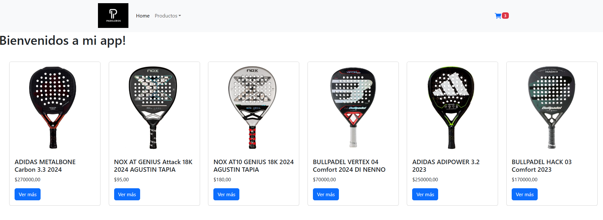

# 🏓 PadelStore - E-commerce de Paletas de Pádel

**Padeleros** es una aplicación web desarrollada en **React** que es una e-commerce dedicado exclusivamente a la venta de **paletas de pádel**. El proyecto incluye funcionalidades como listado de productos, detalles individuales, carrito de compras y formulario de checkout, utilizando **Firebase** como backend.

## 🚀 Tecnologías utilizadas

- ⚛️ **React** 
- 🔥 **Firebase** 
- 💅 **CSS / Tailwind** 
- 📦 **React Router DOM**

---

## 📦 Instalación del proyecto

# 🏓 PadelStore - E-commerce de Paletas de Pádel

**PadelStore** es una aplicación web desarrollada en **React** que simula un e-commerce dedicado exclusivamente a la venta de **paletas de pádel**. El proyecto incluye funcionalidades como listado de productos, detalles individuales, carrito de compras y formulario de checkout, utilizando **Firebase** como backend.

---

## 🚀 Tecnologías utilizadas

- ⚛️ **React** (Vite)
- 🔥 **Firebase** (Firestore, Authentication, Hosting)
- 💅 **CSS / Tailwind** (opcional)
- 📦 **React Router DOM**
- 🛒 Context API para gestión de carrito

---

## 📦 Instalación del proyecto

- Clone el repositorio
- Haga el comando cd coder-flex-73690 para moverse a la carpeta del proyecto
- Instale dependencias con el comando npm install
- Para levantar la app en el servidor local ejecute el comando npm run dev

